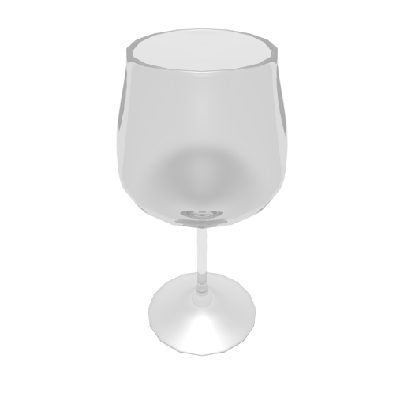
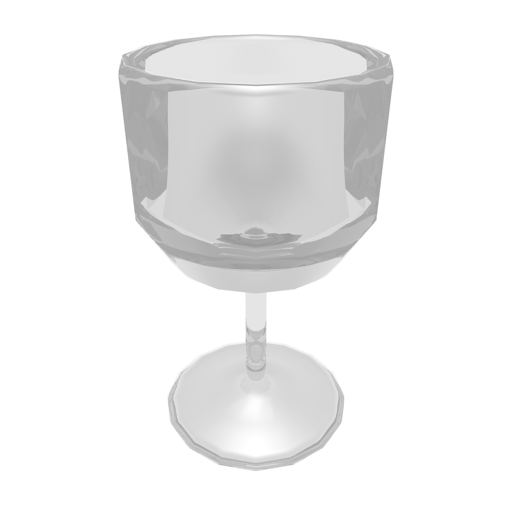

# blender-wineglass
This is a sample project of Blender.

## wineglass.blend

This is a surface version of the wine glass generated by screwing a Bezier curve.

## wineglass-low-polygon.blend

This is a polygon version of the wine glass with a small number of polygons.

## References
This project refers to the following websites:

- https://www.dctweb.jp/20140718k/
- https://www.dctweb.jp/20140917k/